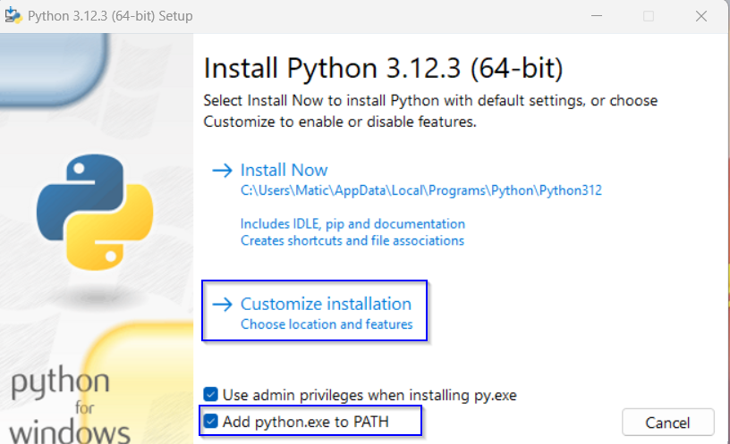
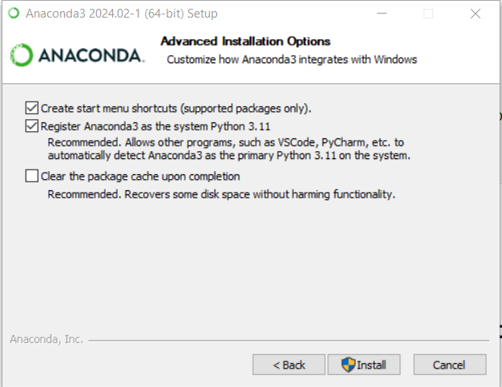
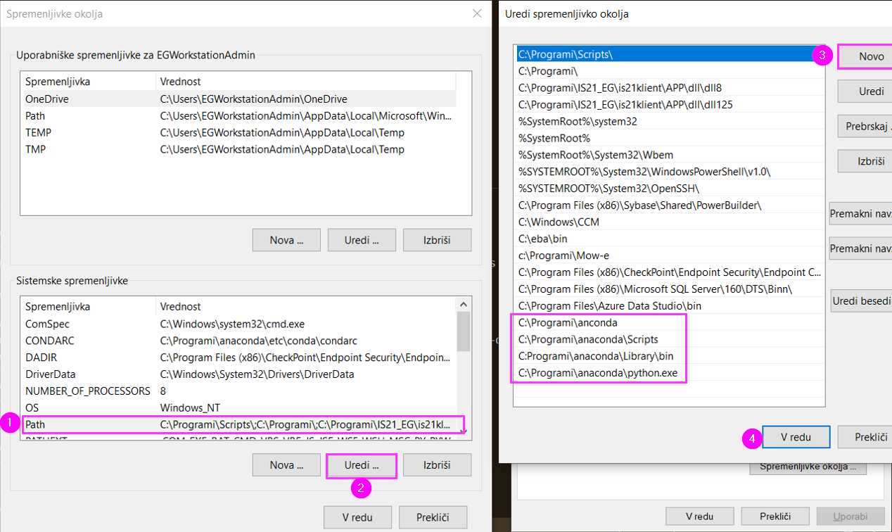
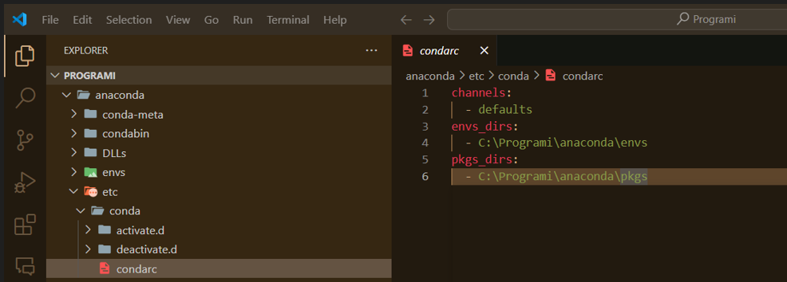
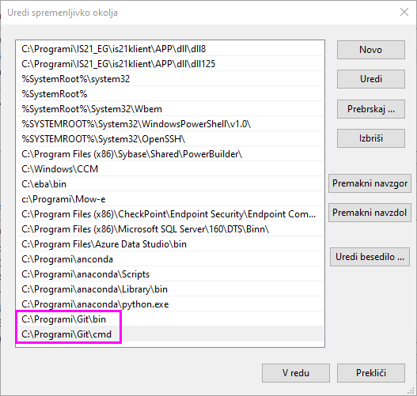

# Setting Up Your Work Environment

## Downloads for Your Work Environment

Download the following tools for your work environment:
- [Anaconda](https://www.anaconda.com/download) (Skip email registration, right bottom corner),
- [VSCode](https://code.visualstudio.com/download) (IDE)
- [Git](https://git-scm.com/downloads) (version control)
- [Notepad++](https://notepad-plus-plus.org/downloads/) (QOL text editor)
- **Optional:** [Python 3.9](https://www.python.org/downloads/release/python-3913/) (or 3.10). We will install python with Anaconda, therefore this one is optional.

**Don't get on installing just yet!**

## Available Software on Your Computer

The Software Center includes:
- SSMS/SQL Management Studio, for database access
- QGIS, an open-source GIS program
- Greenshot, for screenshots
- ABBYY FineReader PDF, for editing PDFs
- Adobe Acrobat, for PDFs
- 7-Zip, for zip files

## Web applications used:

We use different web applications like:
- monday.com
- ChatGPT
- Medium

## Already Installed

- Microsoft Office
- Microsoft Outlook
- Microsoft Teams (for teams you need to be added to additional groups of our worklpace like RD EG by Blaž, there are also documents of our projects)

## Installation

###### Disclaimer: Most likely you will still have to add all the PATH-s into system variables manually! 


1. Request administrative access via the user support portal or contact Rok Andolšek/ Ares Osrednikar on Microsoft Teams.
2. Install all programs in `C:\Programi\`.
3. When prompted, use the username `.\EGWorkstationAdmin` and the password provided by the EG admin.
4. During the installation process:
* Attempt to install programs for **all users**. 
* Select the option **add to path** where it is possible. 
* **Anaconda** might throw "**Elevation error**" when installing for "all users". In that case select the option "current user".
<br>**If the installation doesn't start:** Right-click > Run as Administrator.

###### If by any chance you do not recieve the question for the admin log in by windows while running an setup you migh have to log into your laptop with the Admin user and password to change some right.

#### During installation:




## Anaconda configuration

###### Disclaimer: Conda only works with powershell and not CMD because of group policies

After the installation you have to complete the following steps:

1. Add The following PATH-s into your system variables (Urejanje spremenljivk delovnega okolja):

* C:\Programi\anaconda
* C:\Programi\anaconda\Scripts
* C:\Programi\anaconda\Library\bin
* C:\Programi\anaconda\python.exe



2. Move all the paths to the top as seen on the picture above.

3. Edit the `C:\Programi\anaconda` folder permissions. Right-click the folder and select properties > security, then click on the "Edit" button. In the new window select the "Users (EGxxxxNB\Users)" group. Finally, allow the following options: Modify, Read & execute, List folder contents, Read, Write.

4. Open VSCode in `C:\Programi\anaconda\etc\conda`. Create a new file named `condarc` (no file type). It serves as a global configuration file for your computer. Paste the following text into the file and hit save:

```
channels:
  - defaults
envs_dirs:
  - C:\Programi\anaconda\envs
pkgs_dirs:
  - C:\Programi\anaconda\pkgs
``` 


5. Add CONDARC as a system variable into system variables as in the picture below 


6. Firstly run `conda init` in powershell CLI , create test environment with your python version from anaconda`conda create --name test_env python=3.11`, afterward use `conda activate test_env ` and check that `pip install pandas` in powershell works.

## Git configuration

Add The following PATH-s into your system variables (Urejanje spremenljivk delovnega okolja):

 * C:\Programi\Git\bin
 * C:\Programi\Git\cmd



## Running Code

Run the code in a folder that is not on OneDrive; otherwise, you will get an error stating that you do not have access in the terminal. We suggest `C:\Programi\projects`.

## Database Access

You need to request permission to connect to the Datawarehouse, which contains a collection of data from multiple databases.

Blaž Dobravec manages permissions and submits access requests through Einformatik, considering NDA due to GDPR to ensure data is not exported to personal computers.

Open SSMS and connect to the server `SRVEGBIDB01p` with the default user `EGxxxx`. Under databases, find `DW.star`. Access to other databases is restricted. For more information on `DW.star`, see [sql_dwh_basics.md](06_sql_dwh_basics.md).

## Installing Python Libraries

**! Keep in mind !** - The use of `conda install` / `pip install` only works outside the corporate network. Otherwise, you will get an SSL error. Therefore, use WiFi - or take a look at the next section.

#### Solve SSL error

If you are inside the corporate network, you can solve the SSL error by creating a `pip.ini` file in the `C:\ProgramData\pip\` folder (maybe you have to create pip folder). Add the following text to the file and save it:

  ```
  [global]
  trusted-host = pypi.python.org
                pypi.org
                files.pythonhosted.org
  ```

and then you can run the `pip install` command in the terminal. If it does not work you can explicitly add the `--trusted-host pypi.org` to the `pip install` command.

  ```
  pip install --trusted-host pypi.org --trusted-host pypi.python.org --trusted-host files.pythonhosted.org <package-name>
  ```

If you encounter an Error that can not install due to OSError: [Errno 13] Permission denied: 'C:\\Programi\\anaconda\\Lib\\site-packages\\<package-name>' you can run the command in the terminal with the `--user` flag.


#### General stepps:
* Activate desired env `conda activate env-name`
* Install packages with conda
* If conda fails install packages with pip

#### Installing with conda
* `conda install package-name`
* version specific: `conda install package-name=2` / `conda install package-name=2.3.4`
* multiple packages: `conda install package-name-a package-b package-c=3.5 ...`
* from specific channel: `conda install -c conda-forge package-name`
  
#### Adding popular channels to conda config. 
This gives us a wider range of available packages that can be installed with conda.
* `conda config --add channels conda-forge`
* `conda config --add channels bioconda`
* `conda config --add channels anaconda`
* `conda config --add channels r`

#### Installing with pip
* `pip install package-name`
* simmilar to conda pip supports version specific installs

#### Certificates in python
Python DO NOT use systems default cerificate store. This can lead to some errors when accesing some APIs (for example when accesing e.Point-Scan with requests library in python you get CERTIFICATE_VERIFY_FAILED). To also include default certificates of the machine you can `pip install pip-system-certs`. Using requests library in paython should now work with ex. e.Point-Scan.

## Github

Inform Blaž Dobravec of your Github username so you can be added to different repositories from [EG-ResearchAndDevelopment](https://github.com/EG-ResearchAndDevelopment).
