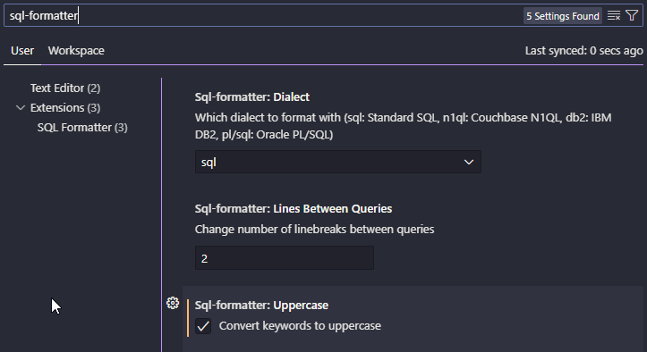

# SQL Naming convention

## 1. General Formatting

We will be using the same principle in naming as in code formatting. While formatting our code we want to avoid any š,č,ž,etc.. To avoid any encoding issues and instead of blank spaces we will be using the (`_`).

```python
    TOV. ŠT >> tovarniska_stevilka
    TransformerStationSID >> transformer_station_sid
```

SELECT, FROM, WHERE, ... Are staying in uppercase letters which handles our formater with the setting `Sql-formatter: Lines between queries` we leave the other settings on default.



### 2. SQL CODE FORMATTER of choice

We will be using the extension "SQL Formatter" in the vsc marketplace.

To use the formater we will have to firstly save our query into a `.sql` file, because the formatter only works in the SQL language, while some formaters do work directly in python it also risks to break the code and we still have to only select the query.

If the data is used somewhere in your code and not in a short analysis the naming of the columns should be in sync with [Base Names](08_base_names.md) .

```sql
#unformated SSMS query:
SELECT [SMM] AS smm
      ,[MerilnoMestoSID] AS merilno_mesto_sid
      ,[TransformatorskaPostajaSID] AS tp_sid
      ,[Tok_L1] AS i1
      ,[Tok_L2] AS i2
      ,[Tok_L3] AS i3
      ,[DelovnaEnergija] AS a
      ,[DelovnaMoč] AS p
      ,[JalovaMoč] AS  q
      ,[DatumUraCET] AS date_time
      ,[TransfomatorSID] AS tp
  FROM [DW_Star].[dbo].[FactKrivuljeNMC]
  WHERE TransformatorskaPostajaSID= 419 and DatumVeljavnostiCETID >= '2021-06-01' and DatumVeljavnostiCETID <= '2023-06-01'

#formated for python:
SELECT
    [SMM] AS smm,
    [MerilnoMestoSID] AS merilno_mesto_sid,
    [TransformatorskaPostajaSID] AS tp_sid,
    [Tok_L1] AS i1,
    [Tok_L2] AS i2,
    [Tok_L3] AS i3,
    [DelovnaEnergija] AS a,
    [DelovnaMoč] AS p,
    [JalovaMoč] AS q,
    [DatumUraCET] AS date_time,
    [TransfomatorSID] AS tp
FROM
    [DW_Star].[dbo].[FactKrivuljeNMC]
WHERE
    TransformatorskaPostajaSID = 419
    AND DatumVeljavnostiCETID >= '2021-06-01'
    AND DatumVeljavnostiCETID <= '2023-06-01'
```

As we can see it put our main keyword into uppercase (`'WHERE'` and `'AND'` ), put `'SELECT'`,`'FROM'` and `'WHERE'` in seperat rows and their arguemnts underneath them with an indent of 4 spaces and the placement of the `','` is now in the end of the argument .
