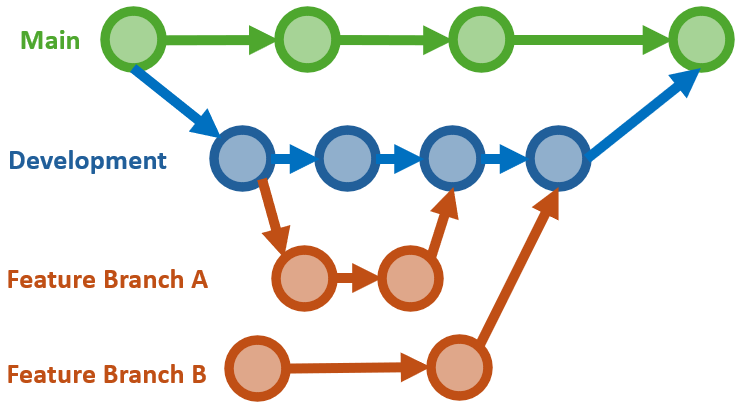

# Git and GitHub Standards for Research and Development Team

Welcome to the Git and GitHub Standards document for our Research and Development team.
This document outlines the best practices and guidelines to ensure efficient, secure, and collaborative use of Git and GitHub.
Following these standards will help us maintain consistency and quality in our projects.

Github docs: [Repository documentation](https://docs.github.com/en/repositories)
>*"Learn to use and manage the repositories that allow you to store and collaborate on your project's code."*

---

## Table of Contents

1. [Starting Up a New GitHub Project](#starting-up-a-new-github-project)
2. [Branching Strategy](#branching-strategy)
3. [Commit Messages](#commit-messages)
4. [Code Reviews and Pull Requests](#code-reviews-and-pull-requests)
5. [Collaboration and Communication](#collaboration-and-communication)
6. [Security Practices](#security-practices)
7. [Repository Maintenance](#repository-maintenance)
8. [Best Practices](#best-practices)

---

## Starting on a GitHub Project
When starting a new project using version control, follow these standards to ensure the project is well-organized, secure, and easy to collaborate on:

- [Starting a new repository](#starting-a-new-repository)
- [Fork an existing repository](#fork-an-existing-repository)
- [Clone an existing repository](#clone-an-existing-repository)

1. #### **Starting a New Repository:**
- GitHub docs: [Quickstart for repositories](https://docs.github.com/en/repositories/creating-and-managing-repositories/quickstart-for-repositories)
> *"Learn how to create a new repository and commit your first change in 5 minutes."*
- Use our team's template found [here](https://github.com/EG-ResearchAndDevelopment/new-project-template).
- Name the repository clearly and descriptively.
- Add a `.gitignore` file appropriate for your project (IMPORTANT❗: Do not commit ANY sensitive information).
- Add a `README.md` file with basic project information.
- Add a `SETUP.md` file with setup instructions.
- Add a `src` directory for source code with an appropriate structure.
- Choose a license that suits the project needs (e.g., MIT, Apache 2.0). Use [choosealicense.com](https://choosealicense.com/) for guidance.

2. #### **Forking an Existing Repository:**
- GitHub docs: [Fork a repo](https://docs.github.com/en/pull-requests/collaborating-with-pull-requests/working-with-forks/fork-a-repo)
> *"A fork is a new repository that shares code and visibility settings with the original “upstream” repository."*
- Click the "Fork" button on the repository page.
- Forked repositories are linked to the original repository, allowing you to pull in changes from the original repository.

3. #### **Cloning an Existing Repository:**
- GitHub docs: [Cloning a repository](https://docs.github.com/en/repositories/creating-and-managing-repositories/cloning-a-repository)
> *"When you create a repository on GitHub.com, it exists as a remote repository. You can clone your repository to create a local copy on your computer and sync between the two locations."*
- Use the `git clone` command followed by the repository URL.
- Make changes locally, commit them, and push the commits back to the repository.

---

## Branching Strategy

1. **Standard Branches:**
- **`main`**: The production-ready branch.
This branch should always be stable and deployable.
- **`develop`**: The integration branch for ongoing development.
Use this branch to merge feature or research branches.
- **`feature`** or **`research`**:
Branches for experimental or research work.
Test new ideas or features here before merging into `develop`.

2. **Merge Strategy:**
- Develop features on the `develop` branch, then merge into the `main` branch for deployment.
- Use research branches to test new ideas and features before integrating them into `develop`.

3. **Branch Naming Conventions:**
- Use clear, descriptive names:
    - `feature/feature_name`
- Use underscores to separate words and avoid special characters.
- Use lowercase names.

4. **Code Standards:**
- Depending on the branch, the code standards may vary.
The `main` branch should have the highest standards, while the `research` branch may have lower standards as it is used for testing or integrating new functionalities.
**Either way, strive towards the set code standards.**

---

## Commit Messages

1. **Commit Message Guidelines:**
- Keep messages clear, concise, and frequent.
- Describe the changes made and their purpose.
- Serve as a backup and progress tracker for the project.

2. **Best Practices:**
- Reference relevant issues (e.g., `Fixes #123`).
- Use the imperative mood (e.g., "Add feature" instead of "Added feature").

---

<!-- 2. **Main Branches:**
    - **`main`** (or `master`): Stable, production-ready code.
    - **`develop`**: Integration branch for ongoing development.

3. **Feature Branches:**
    - Branch off from `develop` for new features or improvements.
    - Merge back into `develop` when the feature is complete.

4. **Bugfix Branches:**
    - Branch off from `develop` or the relevant branch where the bug exists.
    - Merge back into `develop` after fixing the issue.

5. **Hotfix Branches:**
    - Branch off from `main` for critical fixes needed in production.
    - Merge into both `main` and `develop` to ensure consistency. -->

<!-- ## Code Reviews and Pull Requests

1. **Pull Request Guidelines:**
- Create pull requests (PRs) for merging any changes into `main` or `develop`.
- Provide a clear description of the changes and link to relevant issues.
- Ensure PRs are reviewed by at least one other team member.

2. **Merge Strategy:**
- Use "Squash and merge" to keep history clean.
- Resolve all conflicts before merging.

--- -->

<!-- ## Collaboration and Communication

1. **Issue Tracking:**
    - Use GitHub Issues to track tasks, bugs, and feature requests.
    - Label issues appropriately (e.g., `bug`, `enhancement`, `question`).

2. **Project Management:**
    - Use GitHub Projects or other project management tools to track progress.
    - Organize tasks and milestones to align with project goals.

3. **Documentation:**
    - Maintain up-to-date documentation in the `README.md` and other relevant files.
    - Document setup instructions, coding standards, and any other relevant information.

--- -->

## Security Practices

1. **Access Control:**
- Limit repository access to team members who need it.
- Use GitHub's role-based access control to manage permissions.

2. **Sensitive Data:**
- Never commit sensitive information such as passwords or API keys.
- Use configuration files (eg. `.env`) where you store sensitive information and add them to `.gitignore`.
- For cloud services use secret management tools provided by the cloud provider.

3. **Security Updates:**
- Regularly review and update dependencies to address security vulnerabilities.
- Monitor GitHub's security alerts and take appropriate actions.

---

## Best Practices

1. **Consistent Coding Style:**
- Follow the team's [coding style](https://github.com/EG-ResearchAndDevelopment/code_standards).
- Use linters and formatters, such as `isort` and `yapf` to enforce style guidelines. You can use [pre-commit](https://chatgpt.com/share/f2e25466-abbc-476c-94a5-4ce99626799c) to automate this process.

2. **Automated Testing:**
- Write and maintain tests for new code.
- Use continuous integration tools to run tests automatically.

3. **Documentation:**
- Document code thoroughly with comments and in project documentation.
- Keep the `README.md` file updated with relevant project information.

---

By adhering to these standards, our team can work more effectively, ensure code quality, and maintain a secure development environment.
For any questions or clarifications, please reach out to the team lead or the designated GitHub administrator.

Read more about GitHub best practices:
- [Naming conventions for Git Branches — a Cheatsheet](https://medium.com/@abhay.pixolo/naming-conventions-for-git-branches-a-cheatsheet-8549feca2534)
- [Git Cheat Sheet Education](https://education.github.com/git-cheat-sheet-education.pdf)
- [Git Cheat Sheet All](https://www.geeksforgeeks.org/git-cheat-sheet/)